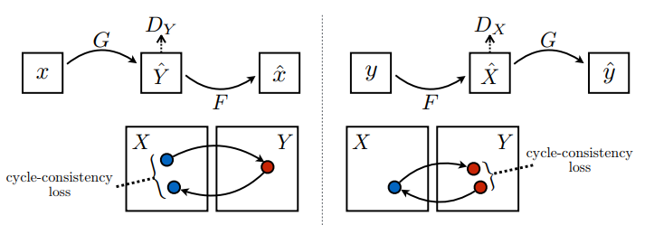
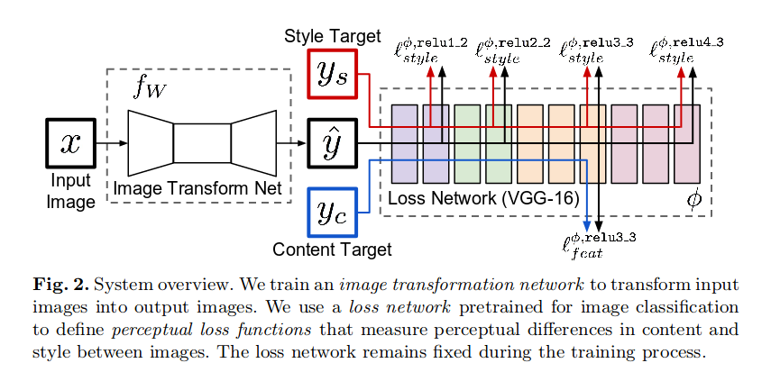

# Image Colorization using CycleGAN

## Introduction
This project attempts to utilize CycleGANs to colorize grayscale images to color RGB images. Image-to-Image translation is a class of vision problems where the goal 
is to learn the mapping between an input image and an output image using a training set of aligned image pairs. But paired dataset may not be available 
for tasks such as image colorization.
This is the where CycleGAN model are very useful as they do not need paired dataset for training

## Training and Results
The images are progressively resized from 64x64 to 512x512 while training CycleGAN model.
Model is trained for total 60 epochs, 17 hours
  - 20 epochs - 64x64 - 40 min,
  - 20 epochs - 128x128 - 80 min,
  - 20 epochs - 256x256 - 300 min (5hrs),
  - 10 epochs - 512x512 - 600 min (10 hrs)
  
The results are as follows

          

## Data
3000 Frames are extracted from public domain B&W movies and Color movies and used for training.

A set of 100 images each for each domain can be found [here](https://github.com/prajwal-suresh13/image_colorization/tree/master/data)

## Model Architecture and Loss functions

The CycleGAN consists of two generators and two discriminators

The generator has three components:
- Encoder : The input image is fed directly into the encoder, which shrinks the representation size while increasing the number of channels. The encoder is composed of three convolution layers with ReLU activation and Instance normalization
- Transformer : The result of encoder is passed to transformer, a series of six residual blocks with ReLU activation, Reflection padding and Instance normalization
- Decoder : Two deconvolutional layers with ReLU activation and Instance normalization, and a final deconvolutional layer with tanh activation boosting back to the original dimensions

The discriminator is composed of five convolutional layers with four layers of LeakyReLU and Instance normalization which produce a one dimensional output. The image is fed through these five layers to obtain a binary output that signals whether the image is fake or not

Since there is no paired data to train, there is no guarantee that the input and target are meaningful during training. Thus in order to enforce that the model learns the
correct mapping, the authors propose the cycle consistency loss ie

input -> Generator A -> target -> Generator B -> generated input - The resulting input and the original input should be same

Along with cycle consistency loss, perceptual loss is also added while training the model. Perceptual loss functions are used when comparing two different images that look similar, like the same photo but shifted by one pixel. The function is used to compare high level differences, like content and style discrepancies, between images.

## References
1. [CycleGAN paper](https://arxiv.org/abs/1703.10593)
2. [Perceptual loss paper](https://arxiv.org/abs/1603.08155) 
